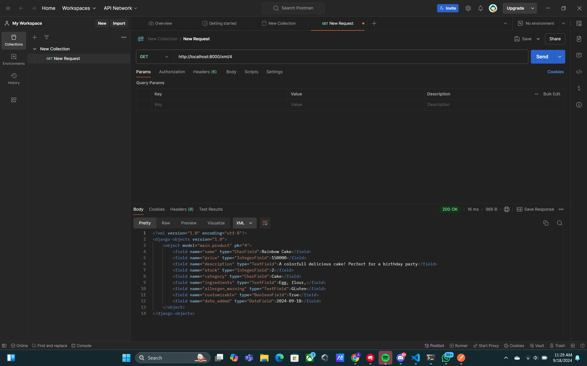
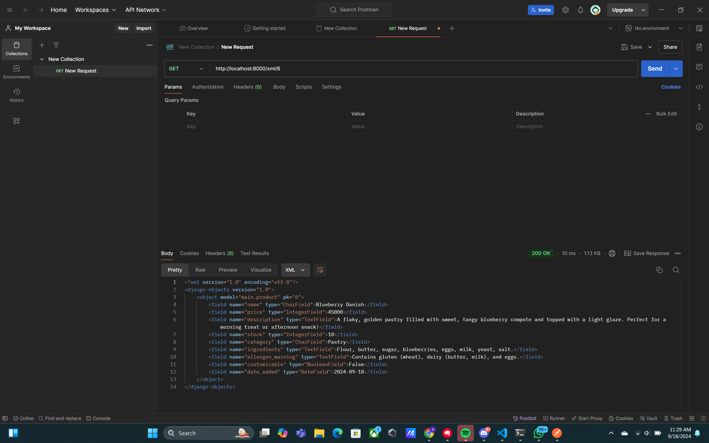
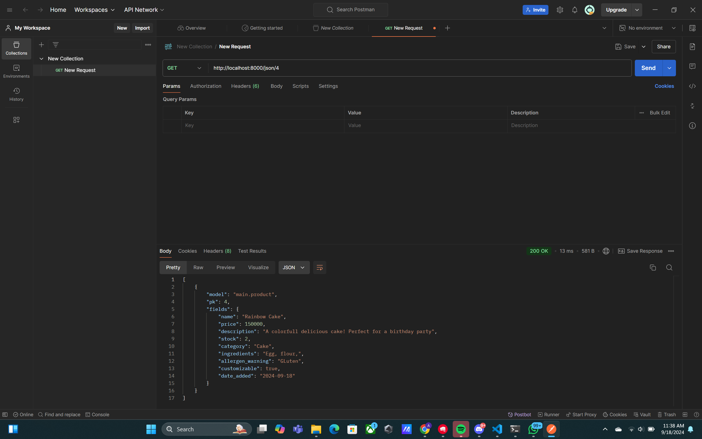
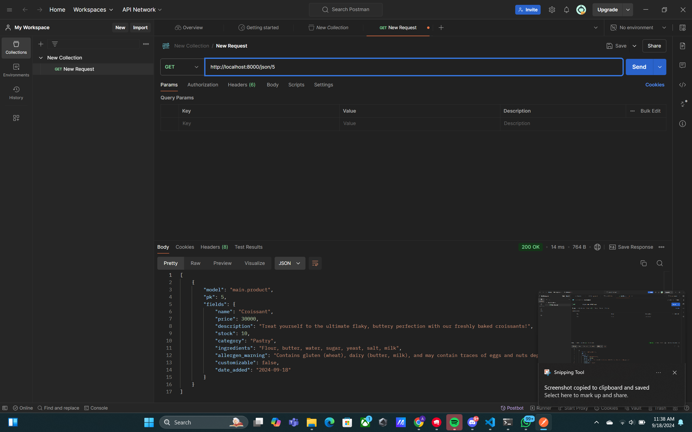

## TUGAS 2
# SweetBites Bakery

Proyek ini adalah platform e-commerce yang dibuat menggunakan Django, memungkinkan pengguna untuk melihat dan membeli produk seperti kue dan pastry. Berikut adalah langkah-langkah implementasi proyek ini secara step-by-step, serta penjelasan mengenai konsep-konsep terkait Django, Git, dan ORM.

## Tautan Deployment
Aplikasi belum di-deploy di PWS

---

1. ## Implementasi Step-by-Step

1. **Membuat Proyek Django**:
   - Saya memulai proyek Django baru menggunakan perintah `django-admin startproject e-commerce`. Perintah ini membuat struktur proyek dasar yang mencakup `settings.py`, `urls.py`, dan beberapa file konfigurasi lainnya.

2. **Membuat Aplikasi Utama**:
   - Di dalam proyek, saya membuat aplikasi bernama `main` dengan perintah `python manage.py startapp main`. Aplikasi ini digunakan untuk mengelola data produk dan halaman untuk toko roti (bakery).

3. **Mendefinisikan Model Product**:
   - Di dalam `models.py`, saya membuat model `Product` dengan field seperti `name`, `price`, `description`, `stock`, `category`, dan `customizable`. Model ini digunakan untuk merepresentasikan data produk di dalam database.

4. **Migrasi**:
   - Setelah mendefinisikan model, saya menjalankan perintah `python manage.py makemigrations` untuk membuat skema database berdasarkan model yang sudah dibuat, dan `python manage.py migrate` untuk menerapkan perubahan tersebut ke database.

5. **Membuat Views dan Template**:
   - Saya membuat fungsi `product_list` di `views.py` yang mengambil semua data produk dari database dan menampilkannya di file template `main.html`. View ini mengirimkan data konteks (seperti daftar produk, nama, dan kelas saya) ke template untuk ditampilkan.

6. **Routing URL**:
   - Di dalam `urls.py`, fungsi view yang sesuai akan dipanggil, dan halaman yang benar akan ditampilkan.

7. **Deployment ke PWS**:
   - Setelah aplikasi selesai, saya melakukan deployment ke PWS dengan menambahkan URL deployment di `ALLOWED_HOSTS` pada file `settings.py` dan menjalankan perintah `git push pws main` untuk mem-push kode saya ke PWS.

---

## Bagan Request-Response Django

Berikut adalah bagan alur request client ke aplikasi Django beserta responsnya:
Client Request -> urls.py -> views.py -> models.py (optional) -> templates HTML -> Client Response


Penjelasan:
- **urls.py**: Berfungsi untuk memetakan URL yang diminta oleh client ke fungsi yang sesuai di `views.py`.
- **views.py**: Mengambil data (jika diperlukan, melalui `models.py`), memproses logika aplikasi, dan mengembalikan hasil ke template HTML.
- **models.py**: Berfungsi sebagai ORM untuk berinteraksi dengan database, misalnya untuk mengambil atau menyimpan data produk.
- **HTML template**: Menampilkan data yang sudah diambil dan diproses dari views ke halaman web yang dilihat oleh pengguna.

---

## Penjelasan Mengenai Git

Git adalah sistem pengontrol versi (version control system) yang sangat berguna dalam pengembangan perangkat lunak. Dengan Git, kita dapat melacak setiap perubahan yang dilakukan pada kode, memungkinkan rollback ke versi sebelumnya jika ada kesalahan, serta memungkinkan kolaborasi dengan tim pengembang lain. Fitur seperti branch dan merge sangat membantu dalam mengelola berbagai fitur dan bug fix secara paralel.

---

## Mengapa Django Dipilih Sebagai Framework Awal?

Django sering dipilih sebagai framework awal untuk pembelajaran pengembangan perangkat lunak karena sifatnya yang "batteries included," yang berarti Django sudah menyediakan banyak fitur bawaan seperti ORM, admin panel, sistem autentikasi, dan routing yang memudahkan pengembang pemula. Django juga menggunakan pola arsitektur yang jelas (MVT - Model-View-Template), yang membantu memahami alur kerja aplikasi web secara terstruktur.

---

## Mengapa Model pada Django Disebut Sebagai ORM?

ORM (Object-Relational Mapping) pada Django memungkinkan pengembang untuk berinteraksi dengan database menggunakan objek Python, tanpa harus menulis query SQL secara langsung. Setiap model Django merepresentasikan tabel dalam database, dan kita dapat melakukan operasi CRUD (Create, Read, Update, Delete) menggunakan metode Python yang sederhana. ORM mengabstraksi interaksi dengan database sehingga lebih mudah dipahami dan digunakan oleh pengembang.


## TUGAS 3
## Pertanyaan dan Jawaban

### 1. Mengapa kita memerlukan data delivery dalam pengimplementasian sebuah platform?
Data delivery memungkinkan server mengirimkan data ke klien secara efisien, menjaga aplikasi tetap dinamis dan interaktif tanpa perlu memuat ulang halaman.

### 2. Menurutmu, mana yang lebih baik antara XML dan JSON? Mengapa JSON lebih populer dibandingkan XML?
JSON lebih baik untuk aplikasi modern karena lebih ringan, mudah dibaca, dan diproses oleh browser, sementara XML lebih kompleks.

### 3. Jelaskan fungsi dari method is_valid() pada form Django dan mengapa kita membutuhkan method tersebut?
`is_valid()` memeriksa apakah data yang dimasukkan ke dalam form sesuai dengan aturan yang telah ditetapkan. Ini penting untuk validasi sebelum menyimpan data ke database.

### 4. Mengapa kita membutuhkan csrf_token saat membuat form di Django? Apa yang dapat terjadi jika kita tidak menambahkan csrf_token pada form Django? Bagaimana hal tersebut dapat dimanfaatkan oleh penyerang?
`csrf_token` mencegah serangan CSRF. Tanpa itu, penyerang bisa memaksa pengguna yang telah login untuk mengirim permintaan tanpa sepengetahuan mereka.

## Screenshot Postman
## Screenshot Hasil XML





## SCreenshot Hasil JSON






## TUGAS 4
### 1. Apa perbedaan antara `HttpResponseRedirect()` dan `redirect()`?
`HttpResponseRedirect()` dan `redirect()` adalah dua fungsi yang digunakan untuk mengarahkan ulang pengguna ke URL tertentu, tetapi ada sedikit perbedaan cara penggunaannya. `HttpResponseRedirect()` memerlukan URL secara eksplisit sebagai argumen. Sebaliknya, `redirect()` adalah fungsi yang lebih fleksibel karena dapat menerima URL, nama view, atau objek model sebagai argumen. `redirect()` akan menentukan URL berdasarkan argumen yang diberikan dan secara internal menggunakan `HttpResponseRedirect()` untuk melakukan pengalihan.

### 2. Jelaskan cara kerja penghubungan model Product dengan User!
Penghubungan model `Product` dengan `User` biasanya dilakukan menggunakan relasi *foreign key* dalam Django. Pada model `Product`, kita dapat menambahkan `ForeignKey` yang merujuk ke model `User` sebagai pemilik produk atau pengguna yang membuat produk tersebut. Misalnya:
```python
from django.contrib.auth.models import User

class Product(models.Model):
    name = models.CharField(max_length=100)
    price = models.DecimalField(max_digits=10, decimal_places=2)
    description = models.TextField()
    stock = models.IntegerField()
    category = models.CharField(max_length=100)
    customizable = models.BooleanField(default=False)
    user = models.ForeignKey(User, on_delete=models.CASCADE)
```
Relasi ini memungkinkan setiap produk dikaitkan dengan pengguna tertentu, dan dengan `on_delete=models.CASCADE`, jika pengguna dihapus, produk yang mereka buat juga akan dihapus.

### 3. Apa perbedaan antara authentication dan authorization, apakah yang dilakukan saat pengguna login? Jelaskan bagaimana Django mengimplementasikan kedua konsep tersebut.
- **Authentication** adalah proses memverifikasi identitas pengguna, misalnya dengan mengecek username dan password saat login. 
- **Authorization** adalah proses pengecekan apakah pengguna yang sudah terverifikasi memiliki izin untuk mengakses sumber daya tertentu.

Saat pengguna login, proses **authentication** dilakukan untuk memastikan pengguna memiliki kredensial yang benar. Django mengelola proses ini melalui `django.contrib.auth`, di mana `authenticate()` digunakan untuk memeriksa kredensial, dan `login()` untuk mencatat sesi pengguna.

**Authorization** dalam Django diimplementasikan dengan memeriksa izin pengguna, misalnya dengan menggunakan dekorator seperti `@login_required` atau metode `has_perm()` untuk memeriksa apakah pengguna memiliki akses ke tindakan tertentu.

### 4. Bagaimana Django mengingat pengguna yang telah login? Jelaskan kegunaan lain dari cookies dan apakah semua cookies aman digunakan?
Django mengingat pengguna yang telah login dengan menggunakan **session cookies**. Ketika pengguna berhasil login, Django menyimpan sesi pengguna di server dan cookie yang terkait dengan sesi tersebut dikirim ke browser pengguna. Cookie ini berisi informasi yang memungkinkan Django untuk mengidentifikasi sesi pengguna di setiap permintaan selanjutnya.

**Kegunaan lain dari cookies** meliputi:
- Menyimpan preferensi pengguna, seperti pengaturan bahasa atau tema.
- Melacak keranjang belanja dalam aplikasi e-commerce.

Namun, **tidak semua cookies aman**. Cookie yang tidak dienkripsi atau diberi atribut keamanan (seperti `HttpOnly` dan `Secure`) rentan terhadap serangan seperti pencurian cookie. Oleh karena itu, sangat penting untuk memastikan cookie yang berisi informasi sensitif dienkripsi dan aman.

### 5. Jelaskan bagaimana cara kamu mengimplementasikan checklist di atas secara step-by-step (bukan hanya sekadar mengikuti tutorial).
Berikut jawaban terakhir yang sesuai dengan file HTML dan proses yang Anda lampirkan:

### 9. Jelaskan bagaimana cara kamu mengimplementasikan checklist di atas secara step-by-step (bukan hanya sekadar mengikuti tutorial).

Berikut langkah-langkah yang saya lakukan secara mandiri untuk menyelesaikan tugas ini:
1. **Membuat Form Registrasi**:
   - Saya membuat form registrasi menggunakan `UserCreationForm` dari Django. View `register` menangani pembuatan akun pengguna baru dan setelah pendaftaran berhasil, pengguna akan diarahkan ke halaman login. Saya menggunakan template `register.html` untuk menampilkan form registrasi ini, serta `messages.success` untuk memberikan notifikasi setelah pengguna berhasil membuat akun.

2. **Membuat Fungsi Login**:
   - Fungsi `login_user` menangani autentikasi pengguna yang mencoba login. Di dalam view ini, saya menggunakan `AuthenticationForm` untuk memvalidasi form login. Jika valid, saya menggunakan `login(request, user)` untuk mencatat sesi pengguna yang sedang login, dan mengarahkan pengguna ke halaman utama menggunakan `HttpResponseRedirect(reverse("main:show_main"))`. Template `login.html` digunakan untuk menampilkan form login.

3. **Membuat Fungsi Logout**:
   - Fungsi `logout_user` menangani proses logout. Ketika pengguna logout, sesi pengguna dihapus dengan `logout(request)` dan cookie `last_login` juga dihapus menggunakan `response.delete_cookie('last_login')`. Setelah itu, pengguna diarahkan kembali ke halaman login dengan `redirect()`.

4. **Restriksi Akses Halaman**:
   - Saya menambahkan dekorator `@login_required` pada view `show_main` untuk memastikan hanya pengguna yang sudah login yang dapat mengakses halaman utama. Jika pengguna belum login, mereka akan diarahkan ke halaman login.

5. **Menghubungkan `Product` dengan Pengguna**:
   - Saya menambahkan foreign key `User` pada model `Product` sehingga setiap produk yang dibuat dapat diasosiasikan dengan pengguna yang membuatnya. Saya juga memodifikasi form di `create_product.html` agar produk yang ditambahkan terkait dengan pengguna yang sedang login dengan menyimpan `product.user = request.user` sebelum memanggil `product.save()`.

6. **Menggunakan Cookie `last_login`**:
   - Setelah pengguna berhasil login, saya menyimpan waktu terakhir mereka login di cookie bernama `last_login`. Cookie ini di-set menggunakan `response.set_cookie('last_login', str(datetime.datetime.now()))` dan ditampilkan di halaman utama setelah login. Jika pengguna logout, cookie ini akan dihapus. Cookie `last_login` ini ditampilkan di halaman `main.html`.

7. **Menerapkan Deployment dan Versi Kontrol Git**:
   - Setelah menyelesaikan seluruh fitur, saya melakukan migrasi dengan `python manage.py makemigrations` dan `python manage.py migrate`. Kemudian saya melakukan add, commit, dan push ke GitHub dengan perintah Git. Setelah itu, saya mengonfigurasi `settings.py` untuk deployment di PWS dengan menyesuaikan `ALLOWED_HOSTS` dan melakukan `git push pws main` untuk mempublikasikan aplikasi.

Dengan langkah-langkah ini, saya berhasil mengimplementasikan autentikasi, session, cookie, serta pengelolaan produk dalam aplikasi Django secara mandiri, sesuai dengan checklist yang diberikan.

## TUGAS 5
### 1. **Jika terdapat beberapa CSS selector untuk suatu elemen HTML, jelaskan urutan prioritas pengambilan CSS selector tersebut!**
CSS selector memiliki urutan prioritas atau "specificity" untuk menentukan gaya mana yang akan diterapkan ketika ada beberapa selector yang berlaku untuk elemen yang sama. Urutan prioritasnya adalah sebagai berikut:
1. **Inline styles** (gaya langsung pada elemen HTML) memiliki prioritas tertinggi.
2. **ID selectors** (#id) memiliki prioritas lebih tinggi dibandingkan class, pseudo-class, atau attribute selector.
3. **Class selectors** (.class), pseudo-class (:hover), dan attribute selectors ([type="text"]).
4. **Tag selectors** (h1, div, p) memiliki prioritas paling rendah.
5. Jika dua selector memiliki specificities yang sama, gaya yang terakhir ditulis dalam CSS akan diterapkan.

### 2.  **Mengapa responsive design menjadi konsep yang penting dalam pengembangan aplikasi web? Berikan contoh aplikasi yang sudah dan belum menerapkan responsive design!**
Responsive design penting dalam pengembangan aplikasi web untuk memastikan tampilan dan fungsi yang optimal di berbagai perangkat dengan ukuran layar berbeda, seperti ponsel, tablet, dan desktop. Dengan menggunakan teknik seperti media queries, web dapat menyesuaikan tata letak dan konten sesuai dengan ukuran layar pengguna, sehingga meningkatkan pengalaman pengguna (UX). Contoh:
- **Aplikasi yang menerapkan responsive design**: Twitter. Tampilan dan tata letaknya menyesuaikan dengan baik pada berbagai perangkat.
- **Aplikasi yang belum menerapkan responsive design**: Beberapa situs lama yang hanya mendukung tampilan desktop, misalnya situs perusahaan kecil yang tidak diperbarui.

### 3. **Jelaskan perbedaan antara margin, border, dan padding, serta cara untuk mengimplementasikan ketiga hal tersebut!**
1. **Margin**: Ruang di luar elemen, antara elemen dengan elemen lainnya.
   - Contoh implementasi: `margin: 20px;`
2. **Border**: Garis yang mengelilingi elemen, berada di antara padding dan margin.
   - Contoh implementasi: `border: 1px solid black;`
3. **Padding**: Ruang di dalam elemen, antara konten elemen dan border elemen.
   - Contoh implementasi: `padding: 10px;`

Secara keseluruhan, **margin** mempengaruhi jarak luar, **border** adalah garis tepi elemen, dan **padding** menambahkan ruang di dalam elemen sebelum kontennya dimulai.

### 4. **Jelaskan konsep flex box dan grid layout beserta kegunaannya!**
1. **Flexbox**: Digunakan untuk mengatur tata letak elemen dalam satu dimensi (sejajar secara baris atau kolom). Flexbox sangat berguna untuk menyusun elemen secara responsif dengan kontrol yang lebih baik terhadap perataan dan distribusi ruang antar elemen.
   - Contoh penggunaan: `display: flex;` untuk mengatur tata letak baris/kolom secara fleksibel.
2. **Grid Layout**: Digunakan untuk tata letak dua dimensi (baris dan kolom), memungkinkan untuk membuat layout yang lebih kompleks seperti membagi halaman menjadi beberapa bagian yang saling berhubungan.
   - Contoh penggunaan: `display: grid;` untuk membuat grid dua dimensi dengan baris dan kolom yang dapat disesuaikan.

### 5. **Jelaskan bagaimana cara kamu mengimplementasikan checklist di atas secara step-by-step (bukan hanya sekadar mengikuti tutorial)**

1. **Migrasi Database**:
   - Setelah mendefinisikan model, saya menjalankan perintah `python manage.py makemigrations` dan `python manage.py migrate` untuk membuat tabel di database berdasarkan model yang sudah dibuat.

2. **Membuat Views dan URL Routing**:
   - Di dalam `views.py`, saya membuat berbagai fungsi view untuk menampilkan product, mengedit, menambah, dan menghapus data product. Saya juga menambahkan routing di `urls.py` untuk menghubungkan views dengan URL yang relevan.

3. **Menerapkan Login, Logout, dan CSRF Token**:
   - Untuk autentikasi, saya menggunakan `UserCreationForm` untuk registrasi, dan `AuthenticationForm` untuk login. Saya memastikan setiap form memiliki CSRF token untuk mencegah serangan CSRF.
   
4. **Menerapkan Cookie untuk Last Login**:
   - Setelah login berhasil, saya menyimpan waktu terakhir login di dalam cookie `last_login`, dan menampilkan waktu ini di halaman utama.
   
5. **Testing Menggunakan Postman**:
   - Saya menggunakan Postman untuk menguji apakah data dapat dikirim dan diterima dalam format XML dan JSON, serta memastikan endpoint bekerja dengan benar untuk GET dan POST requests.
   
## TUGAS 6
### 1. Jelaskan manfaat dari penggunaan JavaScript dalam pengembangan aplikasi web!

JavaScript adalah bahasa pemrograman yang digunakan secara luas dalam pengembangan aplikasi web karena bersifat **client-side**, memungkinkan interaktivitas yang lebih baik antara pengguna dan tampilan antarmuka. Manfaat utama JavaScript adalah:
- **Responsiveness**: Membuat halaman web lebih interaktif dengan memperbarui konten secara dinamis tanpa perlu me-refresh seluruh halaman.
- **Rich User Experience**: Penggunaan JavaScript memungkinkan fitur-fitur seperti animasi, drag-and-drop, dan validasi form di sisi klien.
- **Kompatibilitas yang Luas**: JavaScript dapat dijalankan di berbagai platform dan browser tanpa memerlukan setup tambahan.
  
### 2.  Jelaskan fungsi dari penggunaan `await` ketika kita menggunakan `fetch()` Apa yang akan terjadi jika kita tidak menggunakan `await`?

`await` digunakan untuk menunggu hasil dari promise yang dikembalikan oleh fungsi asynchronous seperti `fetch()`. Dengan `await`, eksekusi kode akan berhenti sementara sampai proses `fetch()` selesai, sehingga kita dapat memastikan bahwa data telah diterima sebelum melanjutkan ke kode berikutnya. Jika `await` tidak digunakan, kode akan dieksekusi tanpa menunggu `fetch()` selesai, sehingga dapat menyebabkan data yang diharapkan belum tersedia ketika digunakan, yang bisa menimbulkan error atau hasil yang tidak diinginkan.

### 3. Mengapa kita perlu menggunakan decorator `csrf_exempt` pada view yang akan digunakan untuk AJAX POST?

`csrf_exempt` digunakan untuk menonaktifkan proteksi CSRF (Cross-Site Request Forgery) pada view tertentu. Ini berguna ketika kita melakukan **AJAX POST request** yang tidak mengirimkan token CSRF, yang mana secara default Django mengharapkan token ini sebagai bagian dari permintaan POST. Namun, penting untuk menggunakan ini dengan hati-hati, hanya pada request yang aman, untuk menghindari celah keamanan.

###  4. Pada tutorial PBP minggu ini, pembersihan data input pengguna dilakukan di belakang (backend) juga. Mengapa hal tersebut tidak dilakukan di frontend saja?

Melakukan pembersihan data input di backend memberikan lapisan keamanan tambahan karena tidak semua input pengguna dapat dipercaya, bahkan ketika validasi dilakukan di frontend. **Frontend validation** bisa diabaikan atau dimanipulasi oleh pengguna yang jahat, misalnya dengan mengubah JavaScript di browser mereka. Dengan pembersihan di backend, kita memastikan bahwa data yang masuk ke database adalah data yang telah tervalidasi dan aman, sehingga menghindari potensi serangan seperti SQL Injection atau XSS (Cross-Site Scripting).

### 5. Jelaskan bagaimana cara kamu mengimplementasikan checklist di atas secara step-by-step (bukan hanya sekadar mengikuti tutorial)!

1. **Menambahkan Pesan Error Pada Login**  
   Pesan error ditampilkan jika username atau password salah saat login. Pesan ini membantu pengguna mengetahui kesalahan yang terjadi tanpa harus reload halaman.

2. **Menambahkan Product dengan AJAX**  
   AJAX memungkinkan penambahan data secara asynchronous tanpa reload. Hal ini meningkatkan pengalaman pengguna dengan mempercepat proses input data ke server.

3. **Routing untuk AJAX**  
   URL routing diatur agar fungsi AJAX dapat dijalankan saat pengguna mengirim permintaan POST. Hal ini mempermudah komunikasi antara server dan frontend.

4. **Menampilkan Data dengan Fetch API**  
   Fetch API digunakan untuk mengambil data dari server secara asynchronous dan menampilkan daftar produk secara dinamis di halaman web tanpa reload.

5. **Modal Form untuk Penambahan Produk**  
   Form modal memudahkan pengguna untuk menambah produk baru. Dengan menggunakan Tailwind CSS untuk modal, tampilan form terlihat lebih modern dan dinamis.

6. **Keamanan dari XSS**  
   DOMPurify digunakan untuk membersihkan input data dari potensi serangan XSS. Hal ini memastikan aplikasi tetap aman dari serangan yang berusaha mengeksekusi kode berbahaya di browser pengguna.